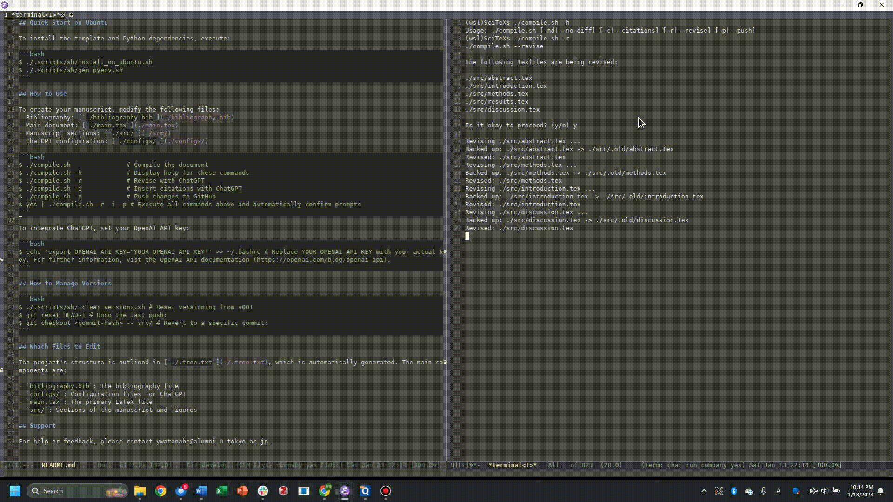

# SciTeX: AI-assisted Template for Scientific Manuscripts




This LaTeX template complies with [Elsevier's manuscript guidelines](https://www.elsevier.com/researcher/author/policies-and-guidelines/latex-instructions) and is adaptable for use with other journals. It simplifies the writing process for documents that have intricate structures and include mathematical expressions.

## Quick Start on Ubuntu

To install the template and Python dependencies, execute:

```bash
$ ./.scripts/sh/install_on_ubuntu.sh
$ ./.scripts/sh/gen_pyenv.sh
```

## How to Use

To create your manuscript, modify the following files:
- Bibliography: [`./bibliography.bib`](./bibliography.bib)
- Main document: [`./main.tex`](./main.tex)
- Manuscript sections: [`./src/`](./src/)
- ChatGPT configuration: [`./configs/`](./configs/)

```bash
$ ./compile.sh               # Compiles the document
$ ./compile.sh -h            # Displays help for these commands
$ ./compile.sh -p            # Pushes changes to GitHub
$ ./compile.sh -r            # Revises with ChatGPT
$ ./compile.sh -t            # Checks terms with ChatGPT
$ ./compile.sh -c            # Inserts citations with ChatGPT
$ ./compile.sh -p2t          # Converts PowerPoint to TIF
$ ./compile.sh -nf           # Does not include figures
$ yes | ./compile.sh -r -i -p # Executes multiple commands and automatically answers yes
```

To integrate ChatGPT, set your OpenAI API key:

```bash
$ echo 'export OPENAI_API_KEY="YOUR_OPENAI_API_KEY"' >> ~/.bashrc # Replace YOUR_OPENAI_API_KEY with your actual key. For further information, vist the OpenAI API documentation (https://openai.com/blog/openai-api).
```

## How to Manage Versions

```bash
$ ./.scripts/sh/.clear_versions.sh # Reset versioning from v001
$ git reset HEAD~1 # Undo the last push:
$ git checkout <commit-hash> -- src/ # Revert to a specific commit:
```

## Which Files to Edit

The project's structure is outlined in [`./.tree.txt`](./.tree.txt), which is automatically generated. The main components are:

- `bibliography.bib`: The bibliography file
- `configs/`: Configuration files for ChatGPT
- `main.tex`: The primary LaTeX file
- `src/`: Sections of the manuscript and figures

## Support

For help or feedback, please contact ywatanabe@alumni.u-tokyo.ac.jp.
